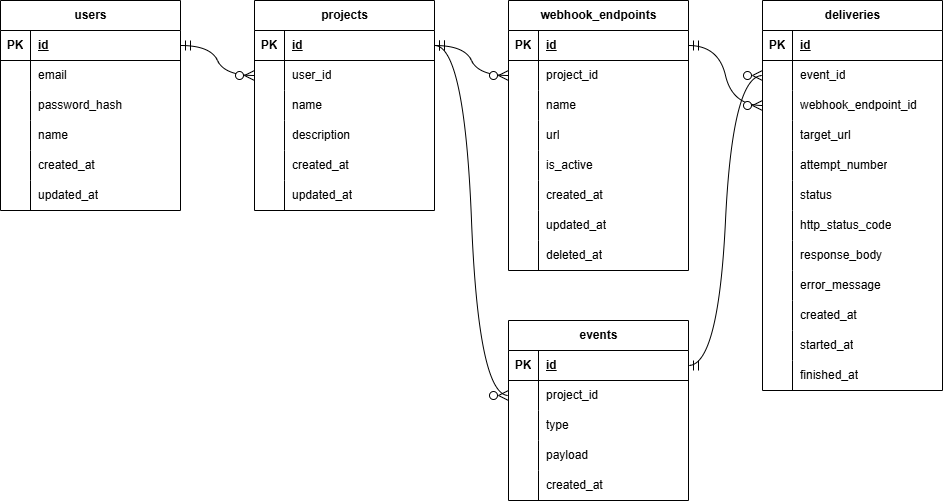

# Webhook Delivery REST API

A REST API for managing projects, webhook endpoints, events, and delivery attempts. It sends each event to all active endpoints in its project and records every delivery result.


## Features

- Registration and login with JWT authentication
- Password hashing with bcrypt
- Project and webhook endpoint CRUD
- Ownership-based resource access
- Events with flexible JSON payloads
- Delivery to multiple active endpoints
- HTTP status, response, error, and timestamp tracking
- Five-second delivery timeout
- Manual retry of the latest failed delivery
- DTO and environment validation
- TypeORM migrations
- End-to-end tests with Vitest and Supertest
- Postman collection with request and response examples

## Technology Stack

- Node.js 24, TypeScript, NestJS
- PostgreSQL 17 and TypeORM
- JWT and bcrypt
- Zod and class-validator
- Vitest and Supertest
- Docker Compose and pnpm

## Architecture

The project combines a modular layered architecture with the repository pattern.

```text
HTTP Request
     |
     v
Controller
     |
     v
Service
     |
     v
Repository
     |
     v
PostgreSQL
```

Each domain has its own NestJS module:

```text
AuthModule
UsersModule
ProjectsModule
WebhookEndpointsModule
EventsModule
DeliveriesModule
```

### Controller layer

Controllers define routes, read validated input, and pass the authenticated user to services. They do not contain business rules or database queries.

### Service layer

Services implement business rules such as ownership checks, event publishing, delivery dispatch, status transitions, and retry eligibility.

### Repository layer

Repositories contain TypeORM queries, including ownership-scoped lookups, active endpoint selection, delivery creation, and status updates.

### Why this architecture?

The modular structure keeps each domain focused and independently testable. The layered flow separates HTTP handling, business rules, and persistence concerns. The repository pattern prevents TypeORM queries from spreading through controllers and services. This keeps business logic readable, makes ownership rules consistent, and allows persistence details to change without rewriting the HTTP layer.

## Database Relationships



## Webhook Delivery Flow

When a user publishes an event:

1. The API verifies ownership of the project.
2. It stores the event in PostgreSQL.
3. It finds all active endpoints in the project.
4. It creates one `PENDING` delivery per endpoint.
5. Each delivery moves to `PROCESSING`.
6. The API sends the event with an HTTP POST request.
7. A 2xx response produces `SUCCESS`.
8. A non-2xx response, timeout, or network error produces `FAILED`.
9. The result and timestamps are stored for inspection.

Response bodies are limited to the first 10,000 characters.

The receiving endpoint gets:

```json
{
  "id": "event-uuid",
  "type": "order.created",
  "payload": {
    "orderId": "order-123",
    "total": 150000
  },
  "createdAt": "2026-09-24T08:03:22.931Z"
}
```

Only the latest failed attempt can be retried. A retry creates a new delivery row, increments `attemptNumber`, and sends the original event again.

## Requirements

- Node.js 24 or later
- pnpm
- Docker and Docker Compose

## Setup

Install dependencies:

```bash
pnpm install
```

Create the environment file:

```bash
cp .env.example .env
```

PowerShell:

```powershell
Copy-Item .env.example .env
```

Default development variables:

```env
NODE_ENV=development
PORT=3000

DB_HOST=localhost
DB_PORT=55432
DB_USERNAME=postgres
DB_PASSWORD=postgres
DB_NAME=webhook_delivery

JWT_SECRET=replace-with-at-least-32-characters
JWT_EXPIRES_IN_SECONDS=3600
```

Start PostgreSQL and run the migration:

```bash
docker compose up -d
pnpm run migration:run
```

Start the API:

```bash
pnpm run start:dev
```

The API runs at `http://localhost:3000`.

## Database Migrations

```bash
# Show migration status
pnpm run migration:show

# Run pending migrations
pnpm run migration:run

# Revert the latest migration
pnpm run migration:revert

# Generate a migration after changing entities
pnpm typeorm migration:generate ./src/database/migrations/MigrationName -d ./src/database/data-source.ts --pretty
```

TypeORM synchronization is disabled. Schema changes must use migrations.

## API Endpoints

Every endpoint except registration and login requires:

```http
Authorization: Bearer <access-token>
```

### Authentication

| Method | Endpoint | Description |
|---|---|---|
| `POST` | `/auth/register` | Register a user |
| `POST` | `/auth/login` | Log in and receive a JWT |

### Projects

| Method | Endpoint | Description |
|---|---|---|
| `POST` | `/projects` | Create a project |
| `GET` | `/projects` | List the user's projects |
| `GET` | `/projects/:id` | Get a project |
| `PATCH` | `/projects/:id` | Update a project |
| `DELETE` | `/projects/:id` | Delete a project |

### Webhook Endpoints

| Method | Endpoint | Description |
|---|---|---|
| `POST` | `/projects/:projectId/webhook-endpoints` | Create an endpoint |
| `GET` | `/projects/:projectId/webhook-endpoints` | List project endpoints |
| `GET` | `/webhook-endpoints/:id` | Get an endpoint |
| `PATCH` | `/webhook-endpoints/:id` | Update an endpoint |
| `DELETE` | `/webhook-endpoints/:id` | Soft-delete an endpoint |

### Events

| Method | Endpoint | Description |
|---|---|---|
| `POST` | `/projects/:projectId/events` | Publish an event |
| `GET` | `/projects/:projectId/events` | List project events |

### Deliveries

| Method | Endpoint | Description |
|---|---|---|
| `GET` | `/projects/:projectId/events/:eventId/deliveries` | List event deliveries |
| `GET` | `/deliveries/:id` | Get a delivery |
| `POST` | `/deliveries/:id/retry` | Retry the latest failed attempt |

## API Documentation

The collection includes API requests, variables, scripts, and response examples:

[Postman Collection](./docs/Webhook%20Delivery%20REST%20API.postman_collection.json)

Import it into Postman and run the folders in this order:

```text
Authentication
Projects
Webhook Endpoints
Events
Deliveries
```

## Testing

Start PostgreSQL, then run:

```bash
pnpm run test:e2e
```

The E2E suite covers authentication, JWT-protected routes, project and endpoint CRUD, ownership, event validation, successful and failed dispatch, and manual retry.

## Project Structure

```text
src/
├── auth/
├── config/
├── database/
│   └── migrations/
├── deliveries/
├── events/
├── projects/
├── users/
├── webhook-endpoints/
├── app.module.ts
└── main.ts

test/
├── auth.e2e-spec.ts
├── deliveries.e2e-spec.ts
├── events.e2e-spec.ts
├── projects.e2e-spec.ts
└── webhook-endpoints.e2e-spec.ts

docs/
├── ERD.png
└── Webhook Delivery REST API.postman_collection.json
```